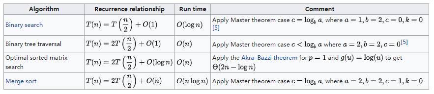

# 时间复杂度和空间复杂度
算法复杂度包括空间复杂度和时间复杂度，是衡量算法执行效率的重要指标。为了充分利用计算资源，提高业务处理效率，最有效的一种解决方式就是优化算法。

<!--more-->
在介绍空间复杂度和时间复杂度之前先问一个问题：为什么不通过执行代码，然后统计算法执行的时间和占用的内存大小来度量算法执行效率呢？

答案显而易见，算法执行时间受硬件影响，同一段代码在不同机器上执行时间可能都会不一样。再者，执行时间也受数据影响，比如数据规模，还有比如排序算法中，如果排序数据长度大小相同，但有序度不一样，执行时间也会有很大差别的。

算法复杂度通常用大O表示法（Big O notation），计算算法的渐近复杂度(asymptotic complexity)，表示代码执行所消耗资源（CPU时间和内存）随数据规模增长的变化趋势。

## 时间复杂度
时间复杂度表示为： T(n) = O(f(n)) 
- 代码的执行时间T(n)与每行代码的执行次数n成正比
- n表示数据规模的大小
- f(n) 表示每行代码执行的次数总和

### 常见时间复杂度
* O(1)：Constant Complexity 常数复杂度
* O(log(n))：Logarithmic Complexity 对数复杂度
* O(n)：Linear Complexity 线性时间复杂度
* O(n^2)：N square Complexity 平方
* O(n^3): N cubic Complexity 立方
* O(2^n): Exponential Growth 指数
* O(n!): Factorial 阶乘

O(1) < O(logn) < O(n) < O(nlog(n)) < O(n^2) < O(n^3) <O(2^n) < O(n!)

O(1)：
```java
int n=6;
System.out.println("n="+n);
```

O(log(n))：
```java
for (int i= 1; i < n; i=i*2) {   
	System.outt.println("n:"+i) 
}
```


O(n)：
```java
for (int i= 1; i < n; i++) {   
	System.out.println("n:"+i); 
}
```

O(n^2)：
```java
for (int i= 1; i < n; i++) {   
	for (int j= 1; j < n; j++) {       
		System.out.println("i="+i+"j="+j);   
	} 
}
```
O(2^n) ：
```java
int fib(int n) {
	if (n<2) return n;
	return fib(n-1) + fib(n-2);
}
```

### 主定理(Master Theorem)
主定理（The Master Theorem）用于计算分治算法的时间复杂度，将规模为 n 的问题转换为 a 个规模为n/b的子问题，其时间复杂度的递归公式为T(n) = a\*T(n/b) +f(n)，f(n)是将原问题分解成子问题和将子问题的解合并成原问题的解的时间。

更详细介绍参考：
1. [https://en.wikipedia.org/wiki/Master_theorem_(analysis_of_algorithms)](https://en.wikipedia.org/wiki/Master_theorem_(analysis_of_algorithms))
2. [https://zh.wikipedia.org/wiki/%E4%B8%BB%E5%AE%9A%E7%90%86](https://zh.wikipedia.org/wiki/%E4%B8%BB%E5%AE%9A%E7%90%86)

比如二分查找，二叉搜索，归并排序等算法的时间复杂度采用主定理来计算。
搜索算法DFS、BFS，图的遍历时间复杂度也为O(N)


## 空间复杂度
空间复杂度用于度量算法运行过程中临时占用存储空间的大小，可表示为： S(n)=O(f(n)) 
- 代码的执行占用存储空间 S(n)与n成正比
- n表示数据规模的大小
- f(n) 表示存储单元占用大小

常用的空间复杂度为O(1)、O(n)、 O(n^2)，相比时间复杂度，空间复杂度更简单，比如数组的长度，递归的深度。


