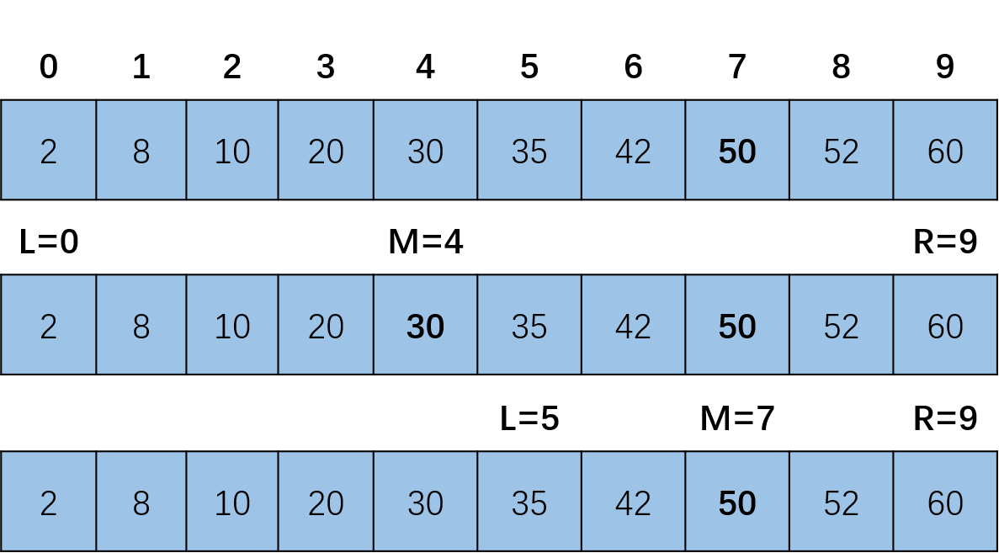

# 常见搜索算法（二）：二分查找
搜索具有n个元素有序数组的某个元素时，最直接的方法就是对每个元素进行遍历，也就是线性搜索，时间复杂度为O(n)。 还有一种更高效的搜索方法就是本文要介绍的二分查找，时间复杂度为O(logn)，本文介绍使用Python实现二分查找。


<!--more-->

## 二分查找
二分查找要求查找数组是有序的，将有序的数组分成两半， 如果搜索值小于中间位置记录的值，则进一步查找前一个子表。 否则查找后一个子表。 重复上面的步骤，直到找到该值或不存在（间隔为0）。使用二分查找算法的前提：
1. 查找数组是升序或者降序的
2. 存在上下边界
3. 元素可以通过索引访问


在升序排列数组：`[2, 8, 10, 20, 30, 35, 42, 50, 52, 60]` 中查找元素50.

## python实现二分查找
下面使用Python实现二分查找
```python
from typing import List

class Solution:
    def binarySearch(self, arr: List[int], target:int):
        left, right = 0, len(arr) - 1
        while left <= right:
            mid = (left + right) // 2
            if arr[mid] == target:
                # find the target!!  
                return mid
            elif arr[mid] < target:
                left = mid + 1
            else: 
                right = mid - 1 

if __name__ == "__main__":
    Solu = Solution()
    result = Solu.binarySearch([2, 8, 10, 20, 30, 35, 42, 50, 52, 60],50)
    print(result)
```
执行结果：
```python
7
```
## 时间复杂度
在[算法笔记：时间复杂度和空间复杂度]()中介绍了二分查找的时间复杂度一般使用主定理（The Master Theorem）来计算，时间复杂度可表示为：`T(n) = T(n/2) + f(n)`

下面推导一下二分查找时间复杂度的计算过程。

假设数组长度为`n`，且是有序的，迭代次数用`k`表示。
1. 第一次迭代数组长度为`n`
2. 第二次迭代数组长度为`n/2`
3. 第三次迭代数组长度为`(n/2)/2=n/(2^2)`
4. 第k次迭代数组长度为`n/(2^k)=1`

根据`n/(2^k)=1`可得`n = 2^k`

两边取对数：`log2(n) = log2(2^k)`
可得出：`k = log2(n)`

所以二分查找的时间复杂度为`log2(n)`

## 小结
本文介绍了对有序数组的二分查找算法，相对于线性搜索它的效率更高。

对于搜索无序的数组，一种方法是先对它进行排序，然后用二分查找的方法，但排序的最优复杂度也是O(nlogn)，使用线性搜索效率可能会更高。还有一种提高无序数组搜索效率的解决方案是使用多线程的方法。


