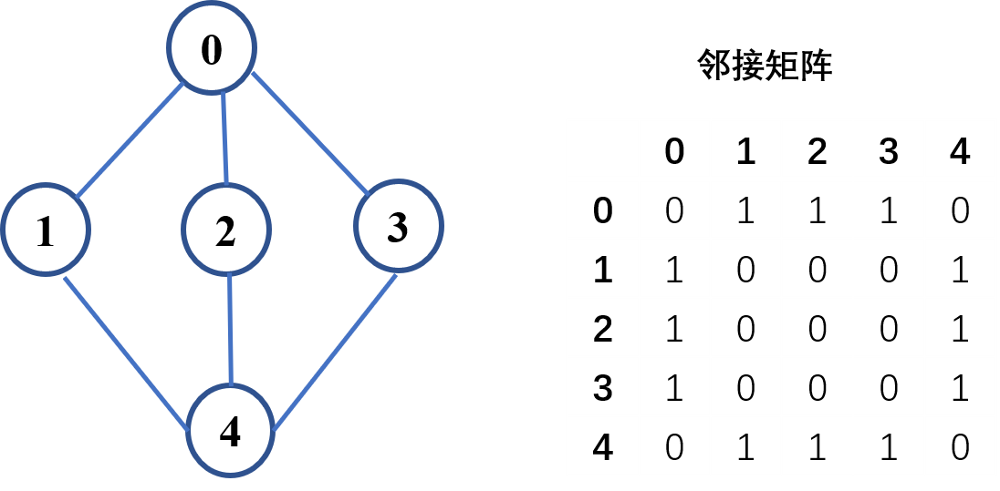
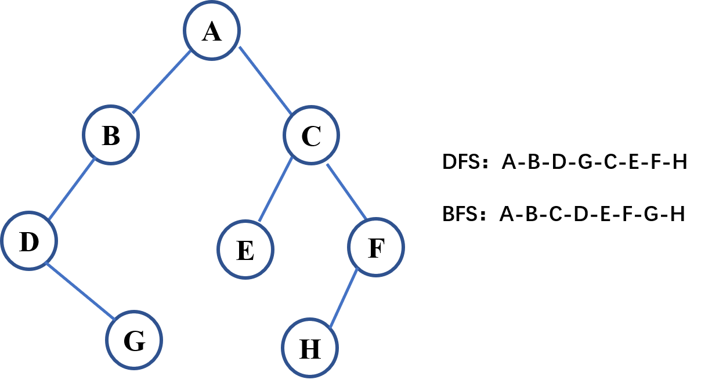

# 常见搜索算法（一）：深度优先和广度优先搜索
搜索算法是非常常用的算法，用于检索存储在某些数据结构中的信息。最简单直接的就是暴力搜索，也就是线性搜索，但它的时间复杂度较高，在实际工程应用中很少使用，需要对它进行优化。

比如二分查找，贪心算法等搜索算法，在[算法笔记：树、堆和图]()中，提到了对图和二叉树的搜索算法：深度优先搜索（DFS）和广度优先搜索（BFS），如果知道起点和终点状态的情况下，还可以使用双向BFS。DFS和BFS根据特定的顺序进行依次搜索，效率也不高，启发式搜索（heuristic search）也就是A\*算法引入估价函数进一步提升了搜索效率，这些算法应用于各种场景中，本文介绍在树和图中常用的深度优先和广度优先搜索算法。


<!--more-->

遍历搜索算法用于在树、图中寻找特定的节点，深度优先搜索(Depth-First-Search, DFS)和广度优先搜索 (Breadth-First-Search, BFS) 是比较常用的两种遍历搜索算法。下面介绍这两种方法在二叉树和图中的使用。


## 深度优先搜索-DFS
DFS是可用于遍历树或者图的搜索算法，DFS与回溯法类似，一条路径走到底后需要返回上一步，搜索第二条路径。在树的遍历中，首先一直访问到最深的节点，然后回溯到它的父节点，遍历另一条路径，直到遍历完所有节点。图也类似，如果某个节点的邻居节点都已遍历，回溯到上一个节点。

在代码实现中，一般会用到栈（递归过程也会自动产生栈）这个数据结构，通过弹栈来回溯到上一个节点。DFS可以使用递归算法实现，也可以不使用递归，下面介绍在图和树这两种数据结构中DFS算法的使用。

### 图
递归写法：
```python
#!/usr/bin/python3
#-*-coding:utf-8-*-

#  图的DFS遍历
from collections import defaultdict
 
class Graph:
    def __init__(self): 
        # 使用字典保存图
        self.graph = defaultdict(list)
 
    def addEdge(self, u, v):
        # 用于给图添加边（连接）
        self.graph[u].append(v)
 
    def DFSTrav(self, v, visited): 
        # 标记已经访问过的节点
        visited.append(v)
         
        # 访问当前节点的相邻节点
        for neighbour in self.graph[v]:
            if neighbour not in visited:
                self.DFSTrav(neighbour, visited)
 
    def DFS(self, v): 
        # 初始化保存已访问节点的集合
        visited = []
 
        # 递归遍历节点
        self.DFSTrav(v, visited)
        print(visited) 
```


非递归写法：
```python
def DFS2(self, v): 
    # 初始化保存已访问节点的集合
    visited = []
    stack = []
    stack.append(v)
    visited.append(v)
    while stack:            
        # 访问当前节点邻居节点的第一个节点，如果没有访问，标记为已访问并入栈           
        for i in self.graph[v]:
            if i not in visited:
                visited.append(i)                                    
                stack.append(i)
                break            
        # 如果当前节点所有邻居节点都已访问，将当前节点弹出（出栈）
        v = stack[-1]
        if set(self.graph[v]) < set(visited):
            stack.pop()
    print(visited) 
```
对下图进行DFS遍历




```python
if __name__ == "__main__": 
    # 新建图
    graph = Graph()
    graph.addEdge(0, 1)
    graph.addEdge(0, 2)
    graph.addEdge(0, 3)
    graph.addEdge(1, 0)
    graph.addEdge(2, 0)
    graph.addEdge(3, 0)
    graph.addEdge(1, 4)
    graph.addEdge(2, 4)
    graph.addEdge(3, 2)
    graph.addEdge(4, 1)
    graph.addEdge(4, 2)
    graph.addEdge(4, 3)
    
    # DFS遍历图：指定一个起点
    graph.DFS(0)
    graph.DFS2(0)
```
输出：
```python
[0, 1, 4, 2, 3]
[0, 1, 4, 2, 3]
```


### 二叉树

对二叉树的DFS遍历与图类似。

DFS递归写法
```python
class Solution:
    def DFSTrav(self, node, visited): 
        # 标记已经访问过的节点
        if node.val in visited:
            return
        
        visited.append(node.val) 
        # 访问当前节点的相邻节点
        if node.left:
            self.DFSTrav(node.left, visited)
        if node.right:
            self.DFSTrav(node.right, visited)

    def dfs(self, root: TreeNode) -> List[List[int]]:
        visited = []
        # dfs
        self.DFSTrav(root, visited)
        print(visited)
```

DFS非递归写法
```python
class Solution:
    def dfs2(self, node): 
        visited = []
        stack = []
        stack.append(node)
        visited.append(node.val)
        while stack:
            if not node.left and not node.right:
                stack.pop()
            node = stack[-1]

            if node.left and node.left.val not in visited:                
                stack.append(node.left)
                visited.append(node.left.val)
                node = node.left

            elif node.right and node.right.val not in visited:
                stack.append(node.right)
                visited.append(node.right.val)
                node = node.right
            else:
                stack.pop()
        print(visited)
```

执行如下代码，对下面的二叉树进行DFS遍历：



```python
if __name__ == "__main__":
    root = TreeNode('A')
    root.left = TreeNode('B')
    root.right = TreeNode('C')
    root.left.left  = TreeNode('D')
    root.left.left.right  = TreeNode('G')
    root.right.left = TreeNode('E')
    root.right.right = TreeNode('F')
    root.right.right.left = TreeNode('H')
    
    solu = Solution()
    solu.dfs(root)
    solu.dfs2(root)
```
输出：
```python
['A', 'B', 'D', 'G', 'C', 'E', 'F', 'H']
['A', 'B', 'D', 'G', 'C', 'E', 'F', 'H']
```

## 广度优先搜索-BFS
BFS是连通图的一种遍历策略，沿着树(图)的宽度遍历树(图)的节点，最短路径算法可以采用这种策略，在二叉树中体现为一层一层的搜索，也就是层序遍历。

在代码实现中，一般使用队列数据结构，下面介绍在图和树这两种数据结构中BFS算法的使用。

### 图
对前面的图进行BFS遍历，关键代码如下：

```python
def BFS(self, v):
    # 新建一个队列
    queue = []

    # 将访问的节点入队
    queue.append(v)
    visited = []
    visited.append(v)
    while queue: 
        # 节点出队
        v = queue.pop(0)

        # 访问当前节点的相邻节点，如果没有访问，标记为已访问并入队
        for i in self.graph[v]:
            if i not in visited:
                queue.append(i)
                visited.append(i)
    print(visited)

```

执行如下代码：
```python
if __name__ == "__main__": 
    # 新建图
    这里省略，和前面一样
    # BFS遍历图：指定一个起点
    graph.BFS(0)
```

输出：
```python
[0, 1, 2, 3, 4]
```

### 二叉树
二叉树的DFS遍历与图类似：

```python
def bfs(self, root: TreeNode) -> List[List[int]]:
    visited = []
    if not root:
        return visited
            
    queue = [root]
    while queue:
        length = len(queue)
        level = []
        for i in range(length):
            node = queue.pop(0)
            # 存储当前节点
            level.append(node.val)
            if node.left:
                queue.append(node.left)
            if node.right:
                queue.append(node.right)
            
        visited.append(level)
    print(visited)
    return visited
```

对前面的二叉树进行BFS遍历结果：
```python
[['A'], ['B', 'C'], ['D', 'E', 'F'], ['G', 'H']]
```


## 二叉树的前序、中序、后序遍历
前序、中序和后序遍历都可以看作是DFS，对下面的二叉树进行遍历：


```python
#!/usr/bin/python3
#-*-coding:utf-8-*-

class BinaryTree:
    def __init__(self, val=0, left=None, right=None):
        self.val = val
        self.left = left
        self.right = right

class BinaryTreeTraversal:
    def preorder(self,root, traverse_path=[]):
        # 前序遍历
        if root == None:
            return traverse_path
        traverse_path.append(root.val)
        self.preorder(root.left, traverse_path)
        self.preorder(root.right, traverse_path)
        return traverse_path

    def inorder(self,root, traverse_path=[]):
        # 中序遍历
        if root == None:
            return traverse_path
        self.inorder(root.left, traverse_path)
        traverse_path.append(root.val)
        self.inorder(root.right, traverse_path)
        return traverse_path

    def postorder(self,root, traverse_path=[]):
        # 后序遍历
        if root == None:
            return
        self.postorder(root.left, traverse_path)
        self.postorder(root.right, traverse_path)
        traverse_path.append(root.val)
        return traverse_path

if __name__ == "__main__":
    root = BinaryTree('A')
    root.left = BinaryTree('B')
    root.right = BinaryTree('C')
    root.left.left  = BinaryTree('D')
    root.left.left.right  = BinaryTree('G')
    root.right.left = BinaryTree('E')
    root.right.right = BinaryTree('F')
    root.right.right.left = BinaryTree('H')

    Traversal = BinaryTreeTraversal()
    print(Traversal.preorder(root))
    print(Traversal.inorder(root))
    print(Traversal.postorder(root))
```

执行结果：
```python
['A', 'B', 'D', 'G', 'C', 'E', 'F', 'H']
['D', 'G', 'B', 'A', 'E', 'C', 'H', 'F']
['G', 'D', 'B', 'E', 'H', 'F', 'C', 'A']
```


## 小结
本文介绍了在图和树中常用的深度优先搜索和广度优先搜索两种算法的Python实现，深度优先算法介绍了递归和非递归两种写法。需要注意图和树这两种数据结构的差异，对它们的介绍可参考[算法笔记：树、堆和图]()，在解决实际问题中，根据具体的条件和要求进行变通。

另外，我也在文章开头提过，这两种遍历算法并不是性能最优，需要根据实际情况进行选择，比如在解决最优路径的问题中，DFS和BFS的效率就比较低，需要使用其它更优算法。


