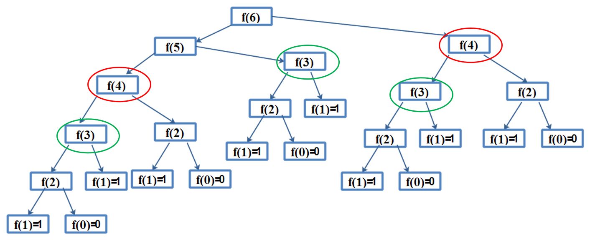

# 递归、动态规划
动态规划是求解决策过程最优化的过程，可以高效求解那些可以分解为高度重复子问题的问题，应用非常广泛，比如解决最短路线、NLP等实际问题。

<!--more-->

## 递归、分治和动态规划
### 德罗斯特效应
德罗斯特效应（Droste effect）是递归艺术中的一种表现形式，德罗斯特效应即在一幅图像中，某个局部图像与整体图像类似，而在这个局部中，又有更小的部分与这个局部类似，依次类推且可无限重复。

<center><font size="2">德罗斯特（Droste）可可粉的包装盒</font></center>

德罗斯特是荷兰的一个著名巧克力品牌，创立于1863年，上面这张图片从1904年起开始使用，数十年间只进行了一些小幅的调整，后来成为一个家喻户晓的概念。诗人及专栏作家Nico Scheepmaker在七十年代起，开始使用“德罗斯特效应”此一词语。下面介绍动态规划算法。

### 递归、分治和动态规划
#### 迭代和递归的区别

* 迭代是将输出作为输入，再次进行处理。
* 递归，自己调用自己，自己包含自己。

#### 分治
 分治（ Divide &Conquer ）是将问题分解为若干个子问题（Divide），递归求解这些子问题（Conquer），然后合并子问题的解。

#### 动态规划
动态规划（Dynamic Programming）和分治策略类似，也是将原问题分解为若干子问题，递归的求解这些子问题，然后合并子问题的解得到原问题的解。
> 通常许多子问题非常相似，为此动态规划法试图**仅仅解决每个子问题一次**，从而减少计算量：一旦某个给定子问题的解已经算出，则将其**记忆化存储**，以便下次需要同一个子问题解之时直接**查表**。这种做法在重复子问题的数目关于输入的规模呈指数增长时特别有用。（维基百科：[动态规划](https://zh.wikipedia.org/wiki/%E5%8A%A8%E6%80%81%E8%A7%84%E5%88%92)）

通常许多子问题非常相似，为此动态规划法试图仅仅解决每个子问题一次，从而减少计算量。动态规划、递归和分治没有根本上的区别，解法都是先找到重复的子问题，也就是将问题拆解成可重复解决的问题。

### 解法
递归问题解法：
1. 找到重复子问题
2. 确定递归终止条件

对于动态规划问题，每个子问题只求解一次，注意将其结果保存起来，进行记忆化存储。

## 斐波那契数
斐波那契数列LeetCode地址：[https://leetcode-cn.com/problems/fibonacci-number/](https://leetcode-cn.com/problems/fibonacci-number/)
### 解法1：暴力递归
```python
class Solution:
    def fib(self, n):
        if n <= 0:
            return 0
        elif n == 1:
            return 1
        else:
            return self.fib(n - 1) + self.fib(n - 2)
if __name__ == "__main__":
    solu = Solution()
    result = solu.fib(6)
    print(result)
```
结果：
```sh
8
```

时间复杂度：O(2^N)
空间复杂度：O(N)

如果数比较大，2^N的时间复杂度将会占用大量资源，计算非常慢。其实暴力递归计算过程中，进行了大量重复计算，我们来看一下Fib(6)的状态树：

我们发现f(4)计算了2次，f(3)计算了3次，其实没必要重复计算，可以使用记忆化存储来保存计算值。
### 解法2：记忆化存储
```python
class Solution:
    def fib(self, n):
        cash = {0:0,1:1}
        def memoize(n):
            if n in cash:
                return cash[n]
            cash[n] = memoize(n - 1) + memoize(n - 2)
            return cash[n]
        return memoize(n)
if __name__ == "__main__":
    solu = Solution()
    result = solu.fib(6)
    print(result)
```

时间复杂度：O(N)
空间复杂度：O(N)

### 解法3：动态规划

```python
class Solution: 
    def fib(self, n): 
        if n <= 1: return n

        dp = [0, 1] + [0]*(n-1)
        for i in range(2, n+1):
            dp[i] = dp[i-1] + dp[i-2]
        return dp[i]
        
if __name__ == "__main__":
    solu = Solution() 
    result = solu.fib(6) 
    print(result)
```

时间复杂度：O(N)
空间复杂度：O(N)

### 解法4：自底向上迭代
可以进一步减少空间复杂度
```python
class Solution: 
    def fib(self, n): 
        if n <= 1: return n
        a, b = 0, 1
        
        for _ in range(1, n):
            c = a + b
            a, b = b, c
        return c
        
if __name__ == "__main__": 
    solu = Solution() 
    result = solu.fib(6) 
    print(result)
```
时间复杂度：O(N)
空间复杂度：O(1)


