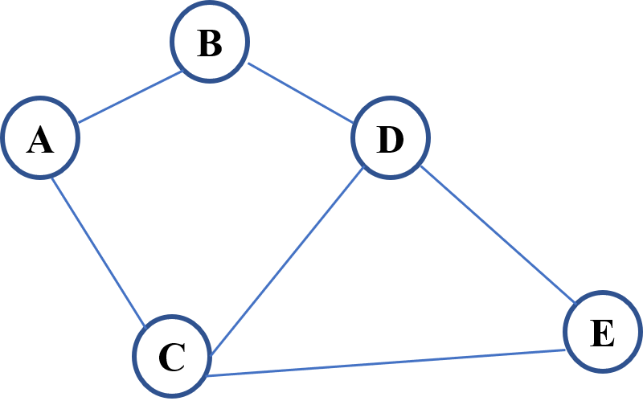
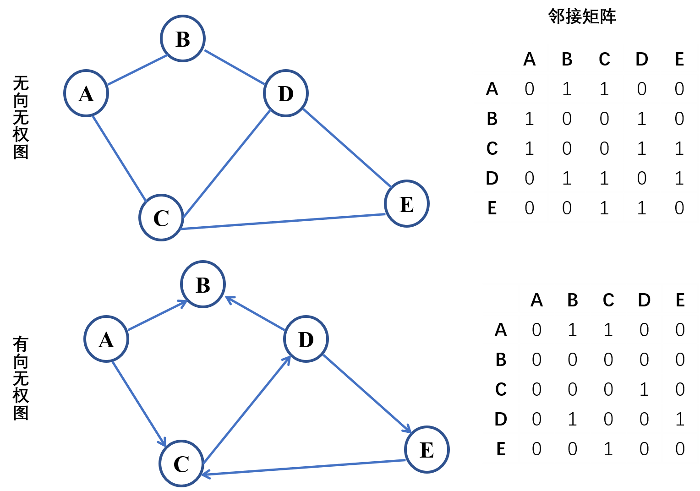
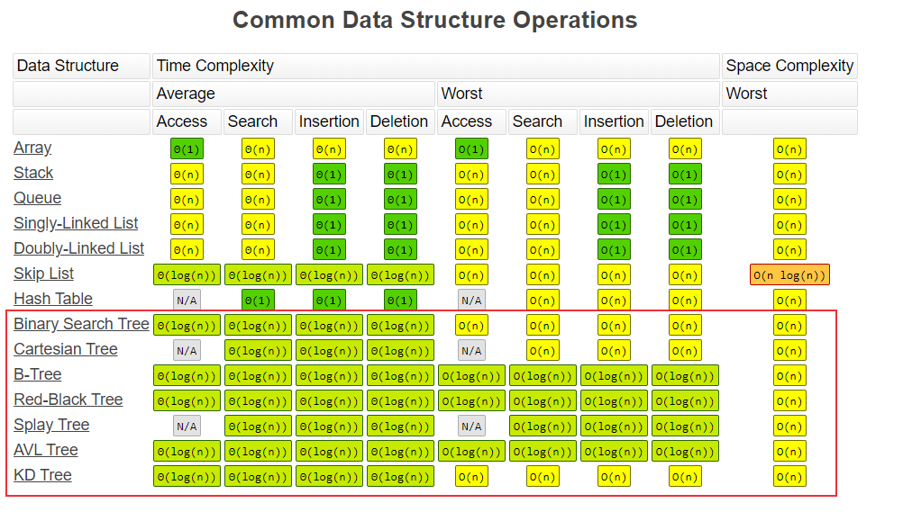
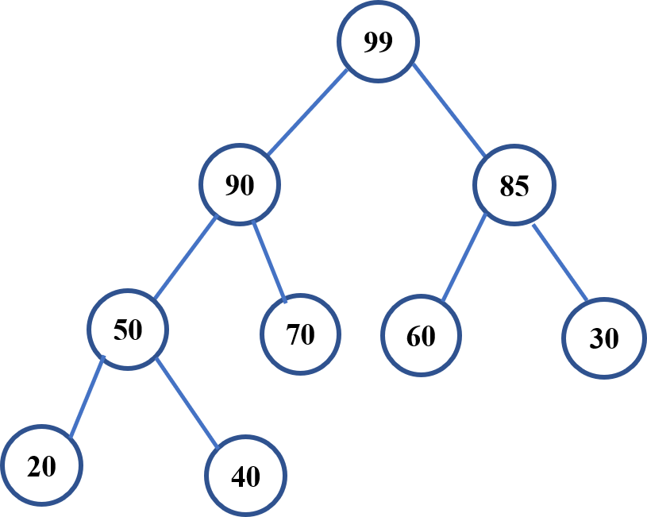
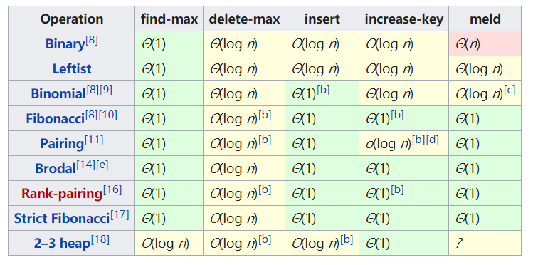

# 树、堆和图
前面的文章介绍过链表，它其实就是特殊化的树，而树是特殊化的图，堆是一种特殊的树。本文将介绍这几种数据结构。

<!--more-->


## 图-Graph
### 图的定义
图是一组顶点和一组边的集合，每条边连接一对顶点。在现实生活中，到处都会遇到图网络的概念，将问题空间表示为网络，比如计算机网络，社交网络等，由一个个节点和连接他们的边组成。



图可以表示为Graph(V, E)：
1、顶点V (vertex)

- 出度：顶点的出边条数
- 入度：顶点的入边条数

2、边E (edge)
- 有向和无向
- 权重


### 图的分类
图主要包括以下几类：
- 无向无权图：节点之间的连接没有方向，是双向的，边没有权重（也可以说权重为1）。
- 无向有权图：节点之间的连接没有方向，有权重，比如两个节点间的物理距离。
- 有向无权图：节点之间通过有向的边连接，只能一个方向。
- 有向有权图：节点之间通过有向的边连接，有权重。



### 图的常见算法
#### DFS-深度优先搜索

深度优先搜索（Depth First Search, DFS）包括：前序遍历Preorder (Root-Left-Right)，中序遍历Inorder (Left-Root-Right) 和后序遍历Postorder (Left-Right-Root)。

#### BFS-广度优先搜索

广度优先搜索（Breadth First Search, BFS）：一层一层的遍历。


## 树-tree
### 二叉树
树是特殊化的图，由有限个节点组成。最常见的是二叉树，每个节点最多有两个子节点（左子节点，右子节点）组成，一个二叉树节点包含以下部分：
- 数据
- 指向左子节点的指针
- 指向右子节点的指针

python二叉树定义：
```python
class BinaryTree:
    def __init__(self, val):
        self.val = val
        self.left = None
        self.right = None
```

### 二叉树遍历
和图的搜索一样，二叉树的搜索也可以使用以下两种遍历搜索方式:
- 深度优先搜索
- 广度优先搜索

深度优先搜索包括前序遍历，中序遍历和后序遍历，每个节点访问一次，且仅访问一次。
- 前序遍历：根左右
- 中序遍历：左根右
- 后序遍历：左右根


### 二叉搜索树
二叉搜索树(Binary Search Tree)，也称二叉排序树、有序二叉树(Ordered Binary Tree)、排序二叉树(Sorted Binary Tree)，是指一棵空树或者具有下列性质的二叉树：
1. 左子树上所有结点的值均小于它的根结点的值
2. 右子树上所有结点的值均大于它的根结点的值
3. 左、右子树也分别为二叉搜索树


二叉搜索树的搜索、插入、移除等操作的动画演示：[https://visualgo.net/zh/bst](https://visualgo.net/zh/bst)

### 复杂度分析



## 堆-Heap
堆是可以迅速找到一堆数中的最大或者最小值的数据结构，根节点最大的堆叫大顶堆或大根堆，根节点最小的堆叫做小顶堆或小根堆。常见的堆有二叉堆(Binary heap)、斐波那契堆(Fibonacci heap)等，下面主要介绍二叉堆。
### 二叉堆
二叉堆是一种特殊的二叉树，和二叉搜索树不同，是一颗完全二叉树。以大顶堆为例，二叉堆满足下列性质：
- 是一棵完全二叉树
- 树中任意节点的值总是 >= 其子节点的值



二叉堆一般都通过数组来实现，上图的二叉堆可表示为一维数组：`[99, 90, 85, 50, 70, 60, 30, 20, 40]` 。可以发现其索引具有以下关系：
-  根节点(顶堆元素)：a[0]
-  索引为`i`的左孩子的索引是`(2*i+1)`
-  索引为`i`的右孩子的索引是`(2*i+2)`
-  索引为`i`的父结点的索引是`floor((i-1)/2)`


### 二叉堆常见操作
对二叉堆的常见操作包括查找(最大值)、删除(最大值)和插入，他们的时间复杂度分别为O(1)、O(logN)和O(logN)。

- 对于插入操作，元素先插入到堆的尾部，然后依次向上调整（与父节点进行比较、交换）整个堆的结构(一直到根)。
- 对于删除操作，先删除堆顶元素，接下来将堆尾元素替换到顶部，然后依次从根部向下调整（和子节点比较，将较大的子节点和它交换）整个堆的结构(一直到堆尾)


二叉堆是用于实现优先队列(priority queue)的数据结构，优先队列中的元素被赋予优先级，具有最高优先级的元素最先删除，具有最高级先出（first in, largest out）的特性。但是二叉堆不是优先队列的最优实现，插入效率较低，比如斐波那契堆(Fibonacci heap)具有更优的性能。

<center><font size="2">图片来源：https://en.wikipedia.org/wiki/Heap_(data_structure)</font></center>


