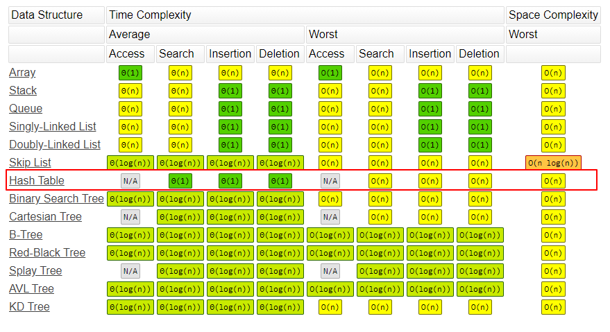

# 哈希表、映射和集合
hash函数是根据关键字key计算出应该存储地址的位置，哈希函数把key转成哈希值来定位数据存储的位置，是基于哈希函数建立的一种查找表，Python 中的字典就是用哈希表来实现的。本文主要介绍哈希表、映射和集合这三种数据结构以及他们在python中用法。

<!--more-->

## 哈希表-Hash table
### 哈希表

哈希表(Hash table)，也叫散列表，根据键(Key)访问在内存储存位置的数据，通过把键值映射到表中一个位置来访问记录，映射函数称为散列函数或者哈希函数，根据哈希函数建立的记录数据的表称为哈希表（散列表）。

比如键值为k，对应的值放在 f(k) 的存储位置上，这个对应关系 f 称为散列函数，通过它来建立的表称为散列表。

### 哈希碰撞

两个不同的key值得到相同的哈希值的情况称为**哈希碰撞（Hash Collisions）**，也就是 f(k1) = f(k2)。哈希碰撞的解决方案有：开放寻址(Open Addressing)法、链地址法(Chaining)、再哈希法（Rehash）和建立一个公共溢出区。
- 开放寻址法：产生冲突后继续寻找下一个空闲的空间（没有被占用的存储地址），Python使用的就是这种方法。
- 链地址法：散列到同一位置的元素，不继续往下寻找，而是将所有关键字为同义词的记录存储在同一线性链表中，HashMap就采用了链地址法。
- 再散列函数法：产生冲突后，就再来一次哈希计算，直到没有冲突。
- 建立一个公共溢出区：也就是建两个表，一个作为基本表，另一个是存储和基本表发生冲突元素的溢出表。

哈希冲突的发生，往往会降低字典和集合操作的速度。因此，为了保证其高效性，字典和集合内的哈希表，通常会保证其至少留有 1/3 的剩余空间。随着元素的不停插入，当剩余空间小于 1/3 时，Python 会重新获取更大的内存空间，扩充哈希表。
### python 字典

Python 中的字典就是典型的哈希表，是一系列由键（key）和值（value）配对组成的元素的集合，其中`value`可以是任何数据类型，且可以重复。`Key`不能重复并且必须是不可变（immutable）的。

在 Python3.7+版本中，字典是有序的， 3.6 之前是无序的。

#### 创建字典
```python
# 创建空字典
>>> mydict={}
>>> type(mydict)
<class 'dict'>
>>> mydict
{}
>>> mydict = {1:"apple",2:"banana"}

# dict()方法创建字典
>>> mydict = dict({1:"apple",2:"banana"})
>>> mydict = dict([(1, 'apple'), (2, 'banana')])
>>> mydict
{1: 'apple', 2: 'banana'}

# fromkeys()方法
>>> seq=(1,2,3)
>>> mydict = dict.fromkeys(seq)
>>> mydict
{1: None, 2: None, 3: None}
>>> mydict = dict.fromkeys(seq,'apple')
>>> mydict
{1: 'apple', 2: 'apple', 3: 'apple'}
```
理论上来说，直接使用`{}`创建字典比dict()方法效率更高， {} 会直接调用底层C代码。

直接使用Dict[Key] = ‘Value’的形式新增元素，可以增加任何数据类型，比如可以嵌套字典，列表等。如果key已经存在，则进行更新。
```python
>>> mydict={}
>>> mydict[2] = 'banana'
>>> mydict
{2: 'banana'}
```
#### 访问元素
直接使用key访问元素值，也可以使用 get(key) 方法获取，如果键不存在，调用 get() 函数可以返回一个默认值
```python
>>> mydict = {1:"apple",2:"banana"}
>>> mydict[2]
'banana'
>>> mydict.get(2)
'banana'
>>> mydict.get(3,'null')
'null'
```
setdefault()方法也可以用来获取元素值，和get()方法不同的是，如果查找的key不存在，它会设置一个默认值（default=None）：
```python
>>> mydict.setdefault(2)
'banana'
>>> mydict.setdefault(3)
>>> mydict
{1: 'apple', 2: 'banana', 3: None}

>>> mydict.setdefault(4,'orange')
'orange'
>>> mydict
{1: 'apple', 2: 'banana', 3: None, 4: 'orange'}
```

#### 删除元素
del删除元素
```python
>>> mydict = {1:"apple",2:"banana"}
>>> del mydict[2]
>>> mydict
{1: 'apple'}
```
pop方法：
```python
>>> mydict = {1:"apple",2:"banana"}
>>> mydict.pop(2)
'banana'
>>> mydict
{1: 'apple'}
>>>
```
popitem()用于随机删除任意键值对

#### 清除字典元素
```python
>>> mydict = {1:"apple",2:"banana"}
>>> mydict.clear()
>>> mydict
{}
```
#### 合并字典

```python
>>> mydict1 = {1:"apple",2:"banana"}
>>> mydict2 = {3:"orange"}
>>> mydict1.update(mydict2)
>>> mydict1
{1: 'apple', 2: 'banana', 3: 'orange'}
>>> 
# 或者
>>> {**mydict1,**mydict2}
{1: 'apple', 2: 'banana', 3: 'orange'}
```
#### 获取字典key，value值
```python
>>> mydict = {1:"apple",2:"banana"}
>>> mydict.keys()
dict_keys([1, 2])
>>> 
>>> mydict.values()
dict_values(['apple', 'banana'])
```
items()方法返回(key, value)对：
```python
>>> mydict = {1:"apple",2:"banana"}
>>> mydict.items()
dict_items([(1, 'apple'), (2, 'banana')])
```
```python
mydict = {1:"apple",2:"banana"}
for key,value in mydict.items():
	print(key)
	print(value)
```

python2中，has_key()可用于判断字典是否存在某个key：
```python
>>> mydict = {1:"apple",2:"banana"}
>>> mydict.has_key(1)
```
python3删除了has_key()方法，可以使用 `in` 操作符来判断：
```python
mydict = {1:"apple",2:"banana"}
if 1 in mydict:
	print(mydict(1))

# 或者
if 1 in mydict.keys():
	print(mydict(1))

```

#### 字典排序
实际应用中，通常需要对字典进行排序，一般会根据键或值，进行升序或降序排序：

根据字典键升序排序
```python
>>> mydict = {1:"apple",3:"banana",2:"orange"}
>>> sorted(mydict.items(), key=lambda x: x[0])
[(1, 'apple'), (2, 'orange'), (3, 'banana')]
```
根据字典值降序排序
```python
>>> sorted(mydict.items(), key=lambda x: x[0], reverse=True)
[(3, 'banana'), (2, 'orange'), (1, 'apple')]
>>>
```
#### 判断一个字典是否包含另一个字典
判断mydictA是否包含mydictB
```python
>>> mydictA = {1:"apple",3:"banana",2:"orange"}
>>> mydictB = {1:"apple"}
>>> dict(mydictB, **mydictA) == mydictA
True
```

## 映射-Map
映射和哈希表类似，也是存储key-value对，通过键(Key)查找值(Value)。
java 的HashMap() 和TreeMap()

* map.set(key, value)
* map.get(key)
* map.has(key)
* map.size()
* map.clear()

### python 映射函数

下面介绍一下python的map()函数用法：
map() 根据提供的函数对指定序列进行映射，返回映射函数返回值的新列表。一般结合lambda匿名函数一起使用：

```python
>>> map(lambda x: x ** 2, [1, 2, 3, 4, 5])
[1, 4, 9, 16, 25]
```
两个list相加：
```python
>>> list1 = [1, 2, 3]
>>> list2 = [4, 5, 6]  
>>> map(lambda x, y: x + y, list1, list2)
[5, 7, 9]
```

## 集合-Set
与列表(list)类似，但集合set没有重复元素，集合没有键和值的配对，是一系列无序的、唯一的元素组合。

字典和集合的内部结构都是一张哈希表，字典存储了哈希值（hash）、键和值这 3 个元素，而集合的哈希表内没有键和值的配对，只有单一的元素。和列表不一样，集合不支持索引操作。

java 的HashSet()和TreeSet()
* set.add(value)
* set.delete(value)
* set.hash(value)

### python集合
可以使用{ }创建集合：
```python
>>> setA = {'apple', 'banana'}
# 或者 setA = set(["apple", "banana"])
>>> setB = {'apple', 'banana', 'orange'}
```
#### 并集
```python
>>> setA.union(setB)
set(['orange', 'apple', 'banana'])
>>> setA | setB
set(['orange', 'apple', 'banana'])
```
#### 交集

```python
>>> setA.intersection(setB)
set(['apple', 'banana'])
>>> setA & setB
set(['apple', 'banana'])
>>> 
>>> setB.intersection_update(setA)
>>> setB
{'banana', 'apple'}
```
isdisjoint() 方法可用于判断两个集合是否包含相同的元素，如果没有返回 True。


#### 差集
```python
>>> setB.difference(setA)
set(['orange'])
>>> setB-setA
set(['orange'])
```
子集判断
```python
>>> setA = {'apple', 'banana'}
>>> setB = {'apple', 'banana', 'orange'}
>>> setA.issubset(setB)
True
>>> setA.issuperset(setB)
False
>>> setB.issuperset(setA)
True
```
#### 对称差集
两个集合中不重复的元素集合
```python
>>> setA.symmetric_difference(setB)
set(['orange'])
>>> setA ^ setB
set(['orange'])
>>> 
>>> setA.symmetric_difference_update(setB)
>>> setA
{'orange'}
```

#### 增加元素
```python
>>> setA.add("orange")
>>> setA
set(['orange', 'apple', 'banana'])
```

#### 删除元素
remove()删除不存在的元素会报KeyError错误，可以使用discard()方法避免KeyError错误。
```python
>>> setA = {'apple', 'banana', 'orange'}
>>> setA.remove('orange')
>>> setA
{'banana', 'apple'}
>>> 
>>> setA.remove('pear')
Traceback (most recent call last):
  File "<stdin>", line 1, in <module>
KeyError: 'pear
>>> setA.discard('pear')
```
pop() 方法也可以用来删除元素，用于删除最后一个元素，但是，集合是无序的，所以不知道到底删除的是哪一个元素。
```python
>>> setA = {'apple', 'banana', 'orange'}
>>> setA.pop()
'banana'
>>> setA
{'orange', 'apple'}
>>>
```
#### 清空集合
```python
>>> setA = {'apple', 'banana'}
>>> setA.clear()
>>> setA
set()
```

#### 冻结集合
冻结后集合不能添加或删除任何元素
```python
>>> frozen_set = frozenset(['apple', 'banana'])
>>> frozen_set.add("orange")
Traceback (most recent call last):
  File "<stdin>", line 1, in <module>
AttributeError: 'frozenset' object has no attribute 'add'
>>>
```
#### 集合排序
集合排序和列表、元组类似，使用 sorted(set) 方法排序：
```python
>>> setA = {'apple', 'orange', 'banana'}
>>> sorted(setA)
['apple', 'banana', 'orange']
```

### python集合运算
python集合支持以下运算：
1、`in` ，`not in`
```python
>>> setA = {'apple', 'banana'}
>>> setB = {'apple', 'banana', 'orange'}
>>> 'apple' in setA
True
>>>
```
2、`==`，`!=`
```python
>>> setA = {'apple', 'banana'}
>>> setB = {'apple', 'banana'}
>>> setA == setB
True
>>>
```
3、`<=`，`<`
setA <= setB：setA是setB的子集
setA < setB：setA是setB的真子集
```python
>>> setA = {'apple', 'banana'}
>>> setB = {'apple', 'banana'}
>>> setA <= setB
True
>>> setA < setB
False
>>> setB = {'apple', 'banana', 'orange'}
>>> setA < setB
True
```
4、`>=`，`>`
setA >= setB：setA是setB的超集
setA > setB：setA是setB的真超集
```python
>>> setA = {'apple', 'banana'}
>>> setB = {'apple', 'banana'}
>>> setA >= setB
True
>>> setA > setB
False
>>> setA = {'apple', 'banana', 'orange'}
>>> setA > setB
True
```

前面提到过，还支持:
* `|`：并集
* `&`：交集
* `-`：差集
* `^`：对称差集


### python集合特点
python集合有以下特点：
1、集合不按特定顺序保存元素，是无序的，不支持索引操作，集合本质上是一个哈希表，可以将集合转换为list后进行索引操作，也可以使用`in` 关键字。
```python
setA = {'apple', 'banana'}
for fru in setA:
    print(fru, end="\n")
```
输出
```text
banana
apple
```

2、python集合只能添加不可变（immutable）的实例，比如可以添加元组（tuple），字符串（string），不能添加列表（list），如果添加的元素为list，可以使用update方法，update方法用于新增多个元素。

```python
>>> a=(1,2)
>>> setA.add(a)
>>> setA
{(1, 2), 'bapple', 'anana'}
>>> 
>>> b=[1,2]
>>> setA.add(b)
Traceback (most recent call last):
  File "<stdin>", line 1, in <module>
TypeError: unhashable type: 'list'
>>> setA.update(b)
>>> setA
{(1, 2), 1, 2, 'bapple', 'anana'}
>>>
```

## 复杂度分析
相比于数组，列表和元组，哈希表和集合的性能更优，特别是对于查找、添加和删除操作，字典都能在常数时间复杂度内完成。对于查找，数组的时间复杂度为 O(n)，如果使用二分查找，也需要 O(logn) 的时间复杂度，但需要对数组进行排序，至少需要O(nlogn) 的时间复杂度。

<center><font size="2">http://www.bigocheatsheet.com/</font></center>


