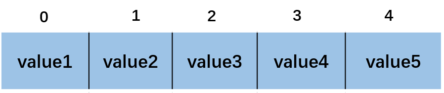
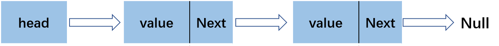
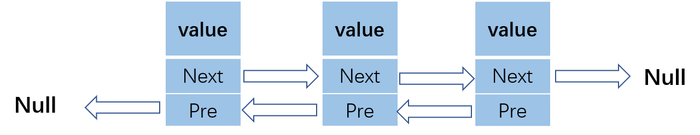
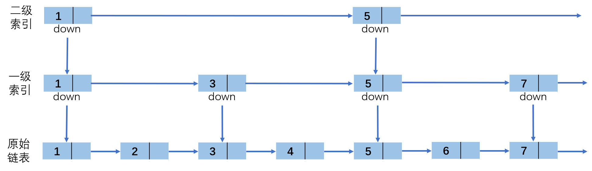
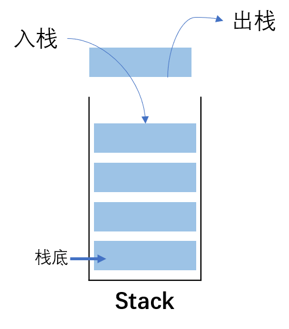
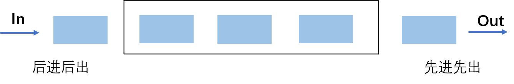
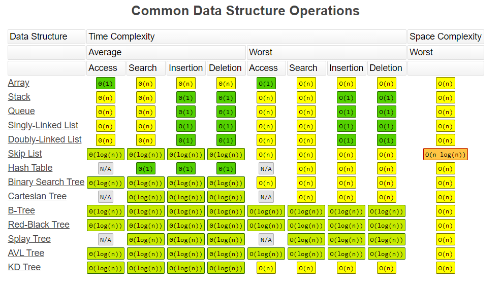

# 数组、链表、栈和队列
从逻辑结构上来说，数组和链表这两种数据结构都属于线性表，从物理存储来看，数组占用一块连续的内存区，而链表在内存中是分散的，由于这种物理结构差异，在对数组和链表进行增删改查操作的时间复杂度不同。栈和队列是特殊的线性表，数组和链表都可以用来实现栈和队列，本文将简要介绍这几种数据结构。

<!--more-->
## 数组-Array
数组使用的是连续的内存空间，内存地址是连续的，所以在声明时一般需要申请固定大小的内存空间。对数组元素的访问可以进行随机访问，时间复杂度为O(1)。

## 链表-Linked List
### 单向链表
链表可以在非连续的空间中存储数据，访问效率低。由节点组成，每个节点都包含下一个节点的指针，在进行删除插入操作时修改相应指针就行，所以相比数组，它的插入删除速度很快。单链表链接方向是单向的，访问要从头部顺序读取

### 双向链表
双向链表的每个结点有两个指针，分别指向直接后继和直接前驱节点，对双向链表的访问可以从任何地方开始。

## 跳表-Skip List
跳表只能用于元素有序的情况，也就是链表元素有序。跳表(skip list)对标的是平衡树(AVL Tree)和二分查找，插入、删除和搜索时间复杂度都是O(log n)，其中Redis中的sorted list使用的就是跳表。

跳表其实是对有序的链表进行升维，也就是空间换时间，升维后就会多一维度的信息：

可以看出，这跟二分查找类似，第k级索引结点的个数为n/(2^k)，在跳表中查询任意数据的时间复杂度就是O(logn)，空间复杂度为O(n)。

## 栈-Stack
栈是一种特殊的线性表，在一端进行操作，特点是先进后出(First in Last out，FILO)，或者说后进先出。

主要包括入栈（push）和出栈（pop）两个操作，Python中可以使用append(data)方法实现入栈操作，使用pop()方法实现出栈操作，可参考：[https://docs.python.org/3/library/collections.html](https://docs.python.org/3/library/collections.html)


## 队列
队列是允许在一端进行插入而在另一端进行删除操作的线性表，特点是先进先出（First in First Out，FIFO）。

在Python中，入队使用append(data)方法实现，出队使用pop(0)。

一种两端都可以进行入队和出队操作的队列称为**双端队列**，还有一种队列叫优先队列(priority queue)，队列中的元素被赋予优先级，具有最高级先出 （first in, largest out）的特点。

## python中的列表和元组
### 列表和元组
列表和元组都是有序的，可以存储任意数据类型的集合，支持切片操作，主要区别如下：
- **列表是动态的**，长度可变，可以随意地增加、删减或者改变元素（mutable）。
- **元组是静态的**，长度大小固定，无法增加删减或者改变元素（immutable）。要想改变元组，只能重新开辟一块内存，创建新的元组。


```python
>>> l = [1, 2, 3]
>>> l.append(4)
>>> l
[1, 2, 3, 4]
>>> 
>>> tup = (1, 2, 3)
>>> new_tup = tup + (4, )
>>> new_tup
(1, 2, 3, 4)
```

由于列表是动态的、可变的，而元组是静态的、不可变的。所以他们的存储方式是有差异的：

```python
l = [1, 2, 3]
l.__sizeof__()
64
tup = (1, 2, 3)
tup.__sizeof__()
48
```

元组的存储空间，比列表要少 16 字节：

- 由于列表是动态的，所以它需要存储指针，来指向对应的元素（int 型，8 字节）。
- 由于列表可变，所以需要额外存储已经分配的长度大小（8 字节），这样才可以实时追踪列表空间的使用情况，当空间不足时，及时分配额外空间。

为了减小每次增加 / 删减操作时空间分配的开销，Python 列表每次分配空间时都会额外多分配一些，这样的机制（over-allocating）保证了其操作的高效性：增加(append()) / 删除(pop())的时间复杂度均为 O(1)。元组长度大小固定，元素不可变，所以存储空间固定。

元组比列表更加轻量级一些，所以元组的性能速度要略优于列表。当然，对于增加、删除或者修改元素，列表的效率更高。在实际应用中，如果存储的数据和数量不变，使用元组更合适。如果存储的数据或数量是可变的，需要随时更新，则使用列表。

### 常用方法
#### 创建列表
```python
>>> l=[]
>>> l = [3, 2, 5, 4, 8, 6]
>>> l=list()
>>> l=list([3, 2, 5, 4, 8, 6])
```

list()是一个function call，创建list时会进行一系列参数检查的操作，而`[]`可以进行直接调用，是一个内置的C函数，下面测试一下他们的性能差异：
```python
>>> python -m timeit -n 1000000 -r 5 -s 'a=[]'
1000000 loops, best of 5: 6.7 nsec per loop
>>> python -m timeit -n 1000000 -r 5 -s 'a=list()'
1000000 loops, best of 5: 7.17 nsec per loop
```
可以发现`[]`方法的性能更优。

#### 增加元素
```python
# 获取list长度
>>> l = [3, 2, 5, 4, 8, 6]
>>> len(l)
6

# 新增元素（末尾添加）
>>> l.append(1)
>>> l
[3, 2, 5, 4, 8, 6, 1]

# 新增多个元素（末尾添加）
>>> l.extend([9,10,12])
>>> l
[3, 9, 2, 5, 4, 8, 6, 1, 9, 10, 12]

# 在指定位置插入元素
>>> l.insert(1, 9)
>>> l
[3, 9, 2, 5, 4, 8, 6, 1]
```
#### 删除元素
可以使用remove、pop和del方法参删除list中的某个元素
```python
>>> l = [3, 2, 5, 4, 8, 6]
>>> l.remove(3)
>>> l
[2, 5, 4, 8, 6]
>>> l.pop(0)  # l.pop()删除最后一个元素
2
>>> l
[5, 4, 8, 6]
>>> del l[0]
>>> l
[4, 8, 6]
>>> del l[0:2]
>>> l
[6]
>>> del l
>>> l
Traceback (most recent call last):
  File "<stdin>", line 1, in <module>
NameError: name 'l' is not defined
>>>
```
对于 Python 3.2以后的版本可以使用clear()清空元素：
```python
>>> l = [3, 2, 5, 4, 8, 6]
>>> l.clear()
>>> l
[]
```

#### 切片
```python
# 获取list长度
>>> l = [3, 2, 5, 4, 8, 6]

# 打印最后一个元素
>>> l[-1]
6

# 打印倒数第3个元素
>>> l[-3]
4

# 打印前3个元素
>>> l[0:3]
[3, 2, 5]

# 打印后3个元素
>>> l[-3:]
[4, 8, 6]

# 倒序输出
>>> l[::-1]
[6, 8, 4, 5, 2, 3]
>>> l.reverse()
>>> l
[6, 8, 4, 5, 2, 3]
>>> l = [3, 2, 5, 4, 8, 6]
>>> list(reversed(l))
[6, 8, 4, 5, 2, 3]

# 间隔1个字符输出
>>> l[::2]
[3, 5, 8]
```
#### 列表推导式
列表推导式是Python中比较常用的功能，用于从其他可迭代对象(如元组、字符串、数组、列表等)中创建新的列表。语法格式如下：
```python
newList = [ expression(element) for element in oldList if condition ]
```
比如计算列表中偶数的平方：
```python
>>> list_num = [3, 4, 6, 2, 5, 8]
>>> list_square = [x ** 2 for x in list_num if x % 2 == 0]
>>> list_square
[16, 36, 4, 64]
>>>
```
上面的列表推导式等价于：
```python
list_num = [3, 4, 6, 2, 5, 8]
list_square = []
for x in list_num:
	if x % 2 == 0:
		list_square.append(x ** 2)
>>>
```
#### 其它方法

下面列出操作list的其它内置方法

|                            方法                             | 描述 | 语法 |
| :---------------------------------------------------------: | :--: | :--: |
| index() |  返回查找元素的索引    |   list_name.index(element, start, end)   |
| count() | 返回目标元素的个数 | list_name.count(object) |
| sort() | 排序，默认升序排列 | 降序：list_name.sort(reverse=True) |
| sorted() | 排序,返回排好序的新列表 | sorted(list_name) |
| reverse() | 翻转列表 | list_name.reverse() |
| reversed() | 翻转列表,返回一个倒转后的迭代器 | reversed(list_name) |
| reduce() | 对可迭代对象(链表、元组等)中元素进行累积 | reduce(fun,seq) |
| sum() | 求和 | sum(iterable, start) |
| max() | 求最大值 | max(list) |
| min() | 求最小值 | max(list) |
| enumerate()  | 返回可迭代对象的下标和值 | enumerate(iterable, start=0) |
| filter() | 过滤序列 | filter(function, iterable) |
| map() | 求最大值 | max(list) |
| min() | 求最小值 | max(list) |

注意，元组没有内置的reverse() 和 sort()这两个函数


## 复杂度分析
理解了这几个数据结构的特性后，我们可以计算出对他们进行增删改查的算法复杂度了，可参考[https://www.bigocheatsheet.com/](https://www.bigocheatsheet.com/) ，列出了对各种数据结构操作的时间复杂度和空间复杂度。

## 参考资料
1. 链表实现代码：[https://www.geeksforgeeks.org/implementing-a-linked-list-in-java-using-class/](https://www.geeksforgeeks.org/implementing-a-linked-list-in-java-using-class/)
2. Java 链表源码：[http://developer.classpath.org/doc/java/util/LinkedList-source.html](http://developer.classpath.org/doc/java/util/LinkedList-source.html)
3. 跳表：[https://redisbook.readthedocs.io/en/latest/internal-datastruct/skiplist.html](https://redisbook.readthedocs.io/en/latest/internal-datastruct/skiplist.html)
4. [https://www.bigocheatsheet.com/](https://www.bigocheatsheet.com/)


