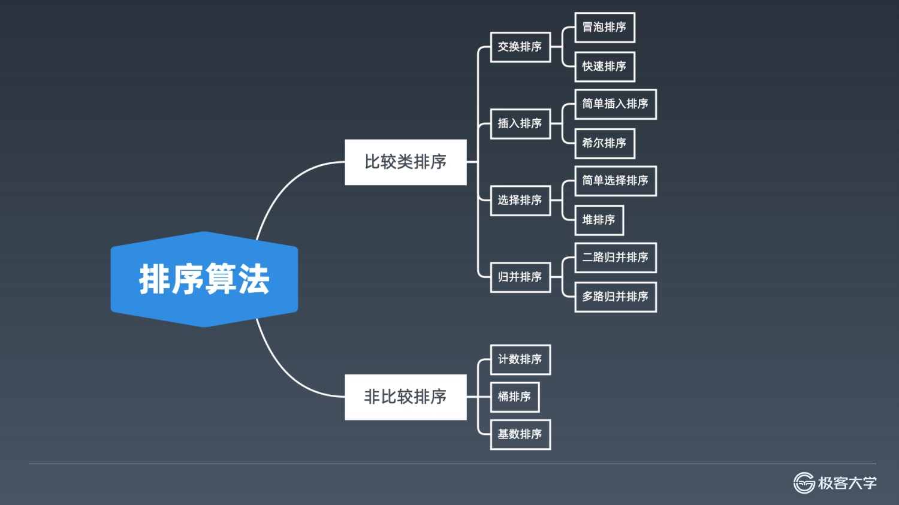
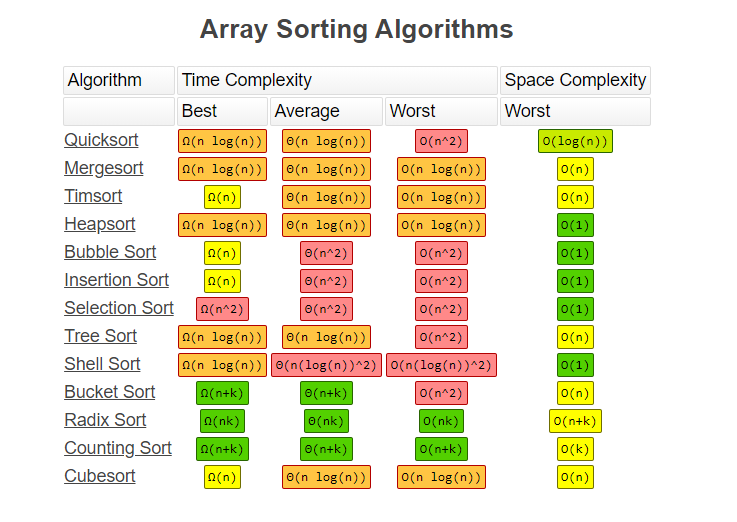
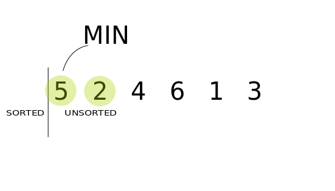

# 排序算法
常见排序算法可以分为两大类：
1. **比较类排序**：通过比较来决定元素间的相对次序，由于其时间复杂度不能突破O(nlogn)，因此也称为非线性时间比较类排序。
2. **非比较类排序**：不通过比较来决定元素间的相对次序，它可以突破基于比较排序的时间下界，以线性时间运行，因此也称为线性时间非比较类排序。
<!--more-->
时间复杂度

<center><font size="2">http://www.bigocheatsheet.com/</font></center>


https://www.geeksforgeeks.org/sorting-algorithms/
https://realpython.com/sorting-algorithms-python/
https://lamfo-unb.github.io/2019/04/21/Sorting-algorithms/

## 初级排序-O(n^2)
1. 选择排序(Selection Sort)：每次找最小值，然后放到待排序数组的起始位置。
2. 插入排序(Insertion Sort)：从前到后逐步构建有序序列；对于未排序数据，在已排序序列中从后向前扫描，找到相应位置并插入。
3. 冒泡排序(Bubble Sort)：嵌套循环，每次查看相邻的元素如果逆序，则交换。

### 选择排序
选择排序将输入列表分为**已排序**和**未排序**两个子列表，首先在未排序的子列表中找到最小的元素，并将其放置在排序的子列表中。这样不断地获取未排序列表的最小元素，按顺序放置在排序的子列表中，直到列表完全排序。

<center><font size="2">https://www.leiphone.com/category/ai/1mIBTKyOx1QPADwQ.html</font></center>

Python实现：
```python
class Solution(object):
    def swap(self, arr, i, j):
        # tmp = arr[i]
        # arr[i] = arr[j]
        # arr[j] = tmp
        arr[i], arr[j] = arr[j], arr[i]
        return arr
        
    def selection_sort(self, arr):
        # 选择排序
        n = len(arr)
        
        for i in range(0, n):
            min_num = i
            for j in range(i + 1, n):
                # 找到最小值
                if arr[j] < arr[min_num]:
                    min_num = j
            
            # 将找到的最小值与第i个元素交换，也就是将最小元素放到前面
            arr = self.swap(arr, i, min_num)      
        return arr
```

### 插入排序
在每个循环迭代中，插入排序从数组中删除一个元素。然后，它在另一个排序数组中找到该元素所属的位置，并将其插入其中。它重复这个过程，直到没有输入元素。


<center><font size="2">https://www.leiphone.com/category/ai/1mIBTKyOx1QPADwQ.html</font></center>
Python实现：
```python
class Solution(object):
    def swap(self, arr, i, j):
        arr[i], arr[j] = arr[j], arr[i]
        return arr
        
    def insertion_sort(self, arr):
        # 插入排序
        n = len(arr)
        
        for i in range(0, n):
            cursor = arr[i]
            pos = i
            # 移动并比较元素
            while pos > 0 and arr[pos-1] > cursor:
                arr[pos] = arr[pos-1]
                pos -= 1
            arr[pos] = cursor
        return arr
```


### 冒泡排序
冒泡排序两两比较两个因素，如果顺序错误则交换，重复遍历，直到完成所有元素排列。

<center><font size="2">https://www.leiphone.com/category/ai/1mIBTKyOx1QPADwQ.html</font></center>

Python实现：
```python
class Solution(object):
    def swap(self, arr, i, j):
        arr[i], arr[j] = arr[j], arr[i]
        return arr
        
    def bubble_sort(self, arr):
        # 冒泡排序
        n = len(arr)
        swapped = True
        x = -1
        while swapped:
            swapped = False
            x = x + 1

            for i in range(1, n-x):
                if arr[i-1] > arr[i]:
                    arr = self.swap(arr, i-1, i)
                    swapped = True
        return arr
```


## 高级排序-O(N\*LogN)
### 快速排序(Quick Sort)
数组取标杆 pivot，将小元素放 pivot左边，大元素放右侧，然后依次对右边和右边的子数组继续快排；以达到整个序列有序。

### 快排代码-Java
```java

// 调用方式： quickSort(a, 0, a.length - 1)
public static void quickSort(int[] array, int begin, int end) {
    if (end <= begin) return;
    int pivot = partition(array, begin, end);
    quickSort(array,begin, pivot - 1);
    quickSort(array,pivot + 1, end);
}

static int partition(int[] a, int begin, int end) {
    // pivot: 标杆位置，counter: 小于pivot的元素的个数
    int pivot = end, counter = begin;
    for (int i = begin; i < end; i++) {
        if (a[i] < a[pivot]) {
            int temp = a[counter]; a[counter] = a[i]; a[i] = temp;
            counter++;
        }
    }
    int temp = a[pivot]; a[pivot] = a[counter]; a[counter] = temp; 
    return counter;
}
```

### 归并排序(Merge Sort)一分治
1. 把长度为n的输入序列分成两个长度为n/2的子序列;
2. 对这两个子序列分别采用归并排序;
3. 将两个排序好的子序列合并成一个最终的排序序列。

归并排序代码-Java
```java
public static void mergeSort(int[] array, int left, int right) {
    if (right <= left) return;
    int mid = (left + right) >> 1; // (left + right) / 2
    mergeSort(array, left, mid);
    mergeSort(array, mid + 1, right);
    merge(array, left, mid, right);
}

public static void merge(int[] arr, int left, int mid, int right) {
    int[] temp = new int[right -left + 1]; // 中间数组
    int i = left, j = mid + 1, k = 0;
    while (i <= mid && j <= right) {
        temp[k++] = arr[i] <= arr[j] ? arr[i++] : arr[j++];
    }

    while (i <= mid) temp[k++] = arr[i++];
    while (i <= right) temp[k++] = arr[j++];

    for (int p = 0; p < temp.length; p++) {
        arr[left + p] = temp[p];
    }
    // 也可以用 System.arraycopy(a, start1, b, start2, length)
}

```

归并和快排具有相似性,但步骤顺序相反
归并：先排序左右子数组，然后合并两个有序子数组
快排：先调配出左右子数组，然后对于左右子数组进行排序

### 堆排序(Heap Sort)
堆插入O(logN),取最大/小值 O(1)
1. 数组元素依次建立小顶堆
2. 依次取堆顶元素，并删除

堆排序代码 - C++
```c++
void heap_sort(int a[], int len) {
    priority_queue<int,vector<int>,greater<int> > q;
    for(int i = 0; i < len; i++) {
        q.push(a[i]);
    }

    for(int i = 0; i < len; i++) {
        a[i] = q.pop();
    }
}

static void heapify(int[] array, int length, int i) {
    int left = 2 * i + 1, right = 2 * i + 2；
    int largest = i;

    if (left < length && array[left] > array[largest]) {
        largest = leftChild;
    }
    if (right < length && array[right] > array[largest]) {
        largest = right;
    }

    if (largest != i) {
        int temp = array[i]; array[i] = array[largest]; array[largest] = temp; 
        heapify(array, length, largest);
    }
}

public static void heapSort(int[] array) {
    if (array.length == 0) return;

    int length = array.length;
    for (int i = length / 2-1; i >= 0; i-) 
        heapify(array, length, i);
    
    for (int i = length - 1; i >= 0; i--) {
        int temp = array[0]; array[0] = array[i]; array[i] = temp;
        heapify(array, i, 0);
    }
}

```

## 特殊排序-O(n)
### 计数排序(Counting Sort)
计数排序要求输入的数据必须是有确定范围的整数。将输入的数据值转化为键存储在额外开辟的数组空间中；然后依次把计数大于1的填充回原数组
### 桶排序(Bucket Sort)
桶排序(Bucket sort)的工作的原理：假设输入数据服从均匀分布，将数据分到有限数量的桶里，每个桶再分别排序(有可能再使用别的排序算法或是以递归方式继续使用桶排序进行排)。
### 基数排序(Radix Sort)
基数排序是按照低位先排序，然后收集；再按照高位排序，然后再收集；依次类推，直到最高位。有时候有些属性是有优先级顺序的，先按低优先级排序，再按高优先级排序。


### 排序动画
•	https://www.cnblogs.com/onepixel/p/7674659.html
•	https://www.bilibili.com/video/av25136272
•	https://www.bilibili.com/video/av63851336


