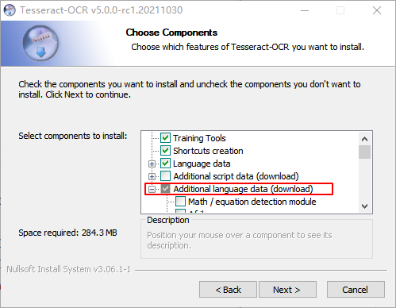
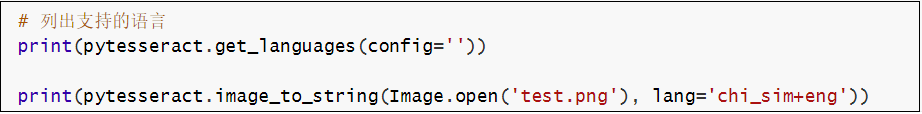
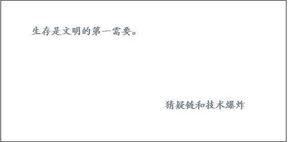
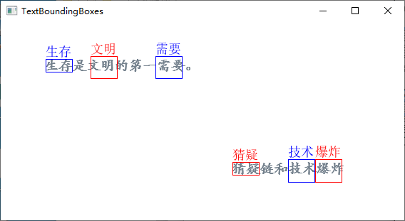
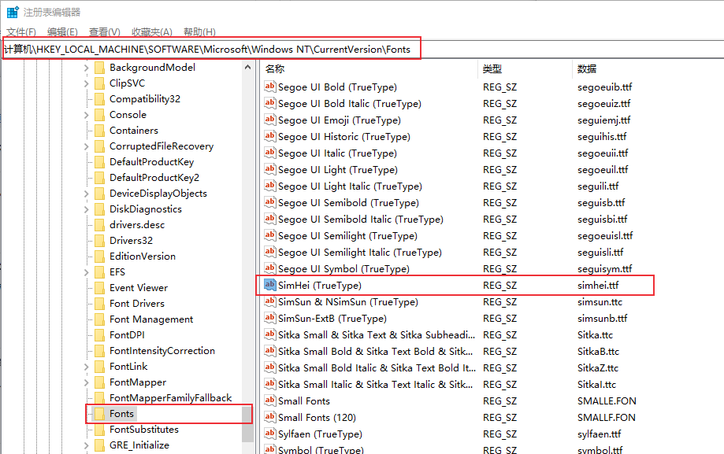
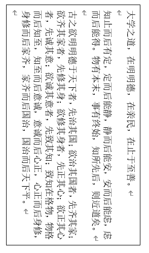
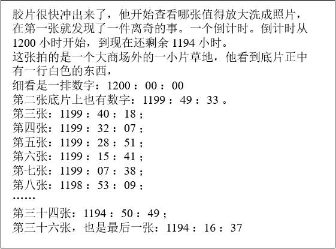

# Python OCR工具pytesseract详解
pytesseract是基于Python的OCR工具， 底层使用的是Google的Tesseract-OCR 引擎，支持识别图片中的文字，支持jpeg, png, gif, bmp, tiff等图片格式。本文介绍如何使用pytesseract 实现图片文字识别。

<!--more-->

## 引言

OCR（Optical character recognition，光学字符识别）是一种将图像中的手写字或者印刷文本转换为机器编码文本的技术。通过数字方式存储文本数据更容易保存和编辑，可以存储大量数据，比如1G的硬盘可以存储数百万本书。

OCR技术可以将图片，纸质文档中的文本转换为数字形式的文本。OCR过程一般包括以下步骤：

1. 图像预处理
2. 文本定位
3. 字符分割
4. 字符识别
5. 后处理

最初由惠普开发，后来Google赞助的开源OCR引擎 tesseract 提供了比较精确的文字识别API，本文将要介绍的Python库Pytesseract就是基于Tesseract-OCR 引擎。

## 环境配置

环境要求：
- Python 3.6+
- PIL库
- 安装Google Tesseract OCR
- 系统：windows/mac/linux，我的系统是Windows10

### 1. 安装Google Tesseract

Tesseract OCR github地址：[https://github.com/tesseract-ocr/tesseract](https://github.com/tesseract-ocr/tesseract)

Windows Tesseract下载地址：[https://digi.bib.uni-mannheim.de/tesseract/](https://digi.bib.uni-mannheim.de/tesseract/)

Mac和Linux安装方法参考：[https://tesseract-ocr.github.io/tessdoc/Installation.html](https://tesseract-ocr.github.io/tessdoc/Installation.html)

安装时可以选择需要的语言包：



安装完成后，添加到环境变量PATH中，我的安装路径是：`C:\Program Files\Tesseract-OCR` 。

命令行窗口输入：`tesseract` ，查看是否安装成功。

```bash
$ tesseract
Usage:
  tesseract --help | --help-extra | --version
  tesseract --list-langs
  tesseract imagename outputbase [options...] [configfile...]

OCR options:
  -l LANG[+LANG]        Specify language(s) used for OCR.
NOTE: These options must occur before any configfile.

Single options:
  --help                Show this help message.
  --help-extra          Show extra help for advanced users.
  --version             Show version information.
  --list-langs          List available languages for tesseract engine.
```

### 2. 安装pytesseract

Python tesseract：[https://github.com/madmaze/pytesseract](https://github.com/madmaze/pytesseract)

pip安装pytesseract

```python
pip install pytesseract
```

另外需要安装一下[Pillow](https://github.com/python-pillow/Pillow)库，用于图像处理。

```python
pip install Pillow
```


## 文字识别小例子

先准备一张包含英文字符的图片，下面的代码实现提取图片中的中文和英文字符，并识别为字符串：

```python
import pytesseract
try:
    from PIL import Image
except ImportError:
    import Image

# 列出支持的语言
print(pytesseract.get_languages(config=''))

print(pytesseract.image_to_string(Image.open('test.png'), lang='chi_sim+eng'))
```

识别下面图片中的文字（test.png）：



执行结果：

```python
['chi_sim', 'eng', 'osd']
拳 列出支持的语言
print(pytesseract.get_languages (config=”))

print(pytesseract.image_to_string(Image.open('test.png'), lang='chi_sim+eng'))

```

## 获取文字位置信息

`image_to_boxes()` 方法返回识别到的字符及字符边框信息。`image_to_data()` 返回单词及单词位置信息。下面来看看这两种方法的执行效果，识别下图中的中文字符：



```python
img = Image.open('testimg2.png')
print(pytesseract.image_to_boxes(img, output_type=Output.STRING, lang='chi_sim'))
print("#"*30)
print(pytesseract.image_to_data(img, output_type=Output.STRING, lang='chi_sim'))
```

执行结果：

```python
生 63 211 80 227 0
存 81 209 118 227 0
是 122 211 139 226 0
文 126 200 154 231 0
明 142 210 157 226 0
的 162 209 197 227 0
第 200 217 218 219 0
一 221 209 236 226 0
需 217 200 253 231 0
要 239 209 259 226 0
。 260 211 266 216 0
猜 325 64 364 82 0
疑 364 64 481 82 0
链 373 54 393 86 0
和 383 54 403 86 0
技 403 54 435 86 0
术 419 54 451 86 0
爆 441 54 477 86 0
炸 469 54 485 86 0

##############################
level	page_num	block_num	par_num	line_num	word_num	left	top	width	height	conf	text
1	1	0	0	0	0	0	0	566	279	-1	
2	1	1	0	0	0	63	52	203	18	-1	
3	1	1	1	0	0	63	52	203	18	-1	
4	1	1	1	1	0	63	52	203	18	-1	
5	1	1	1	1	1	63	52	55	18	96	生存
5	1	1	1	1	2	122	53	17	15	96	是
5	1	1	1	1	3	126	48	31	31	96	文明
5	1	1	1	1	4	162	52	35	18	96	的
5	1	1	1	1	5	200	60	18	2	91	第
5	1	1	1	1	6	221	53	15	17	93	一
5	1	1	1	1	7	217	48	42	31	93	需要
5	1	1	1	1	8	260	63	6	5	91	。
2	1	2	0	0	0	325	197	156	18	-1	
3	1	2	1	0	0	325	197	156	18	-1	
4	1	2	1	1	0	325	197	156	18	-1	
5	1	2	1	1	1	325	197	156	18	94	猜疑
5	1	2	1	1	2	373	193	20	32	77	链
5	1	2	1	1	3	383	193	20	32	92	和
5	1	2	1	1	4	403	193	48	32	96	技术
5	1	2	1	1	5	441	193	44	32	94	爆炸
```

根据`image_to_data()` 方法返回的位置信息，下面来标出识别出的词语位置。

```python
import numpy as np
import pytesseract
from pytesseract import Output
import cv2

try:
    from PIL import Image
    from PIL import ImageDraw
    from PIL import ImageFont
except ImportError:
    import Image
    
img = cv2.imread('testimg2.png')

gray = cv2.cvtColor(img, cv2.COLOR_BGR2GRAY)
thresh = cv2.threshold(gray, 0, 255, cv2.THRESH_BINARY_INV + cv2.THRESH_OTSU)[1]
cnts = cv2.findContours(thresh, cv2.RETR_EXTERNAL, cv2.CHAIN_APPROX_SIMPLE)
cnts = cnts[0] if len(cnts) == 2 else cnts[1]

width_list = []
for c in cnts:
	_, _, w, _ = cv2.boundingRect(c)
	width_list.append(w)
wm = np.median(width_list)

tess_text = pytesseract.image_to_data(img, output_type=Output.DICT, lang='chi_sim')
for i in range(len(tess_text['text'])):
	word_len = len(tess_text['text'][i])
	if word_len > 1:
		world_w = int(wm * word_len)
		(x, y, w, h) = (tess_text['left'][i], tess_text['top'][i], tess_text['width'][i], tess_text['height'][i])
		cv2.rectangle(img, (x, y), (x + world_w, y + h), (255, 0, 0), 1)
		im = Image.fromarray(img)
		draw = ImageDraw.Draw(im)
		font = ImageFont.truetype(font="simsun.ttc", size=18, encoding="utf-8")
		draw.text((x, y - 20), tess_text['text'][i], (255, 0, 0), font=font)
		img = cv2.cvtColor(np.array(im), cv2.COLOR_RGB2BGR)

cv2.imshow("TextBoundingBoxes", img)
cv2.waitKey(0)
```

执行结果：



另外说明一下， `ImageFont.truetype(font="simsun.ttc", size=18, encoding="utf-8")` 用于设置字体及编码格式，原因是`draw.text()` 默认使用ISO-8859-1（latin-1）编码，中文需要使用UTF-8编码。Windows中，字体存放路径一般为`C:\Windows\Fonts` ，已经添加到了环境变量，直接写字体名称就可以了，`simsun.ttc` 表示宋体。

如果不知道字体对应名称可以进入注册表查看：运行窗口或者命令行窗口输入`regedit`打开注册表，进入如下路径：`HKEY_LOCAL_MACHINE\SOFTWARE\Microsoft\Windows NT\CurrentVersion\Fonts` ，可以查看对应字体文件名称。




## 多语言识别

### 使用方法

图片中可能包含了多种语言，比如在上面的例子中，图片包含了中文和英文，`lang='chi_sim+eng'` 表示识别简体中文和英文。

简体中文chi_sim是在安装tesseract时勾选的，`get_languages()` 方法列出了支持的语言，也可以在命令行窗口执行 `tesseract --list-langs` 查看支持的语言：

```bash
$ tesseract --list-langs
List of available languages (3):
chi_sim
eng
osd
```

除了使用 `lang='chi_sim+eng'` 方式指定语言外，也可以使用`config='-l chi_sim+eng'` 形式：

```python
img = Image.open('test.png')
config = r'-l chi_sim+eng --psm 6'
print(pytesseract.image_to_string(img, config=config))
```

执行结果和前面一样。

### 训练数据

如果需要下载其它语言包，可以到这里[https://tesseract-ocr.github.io/tessdoc/Data-Files](https://tesseract-ocr.github.io/tessdoc/Data-Files)下载。

Tesseract 提供了三种训练数据：

| 训练数据                                                     | 训练模型      | 识别速度 | 正确率              |
| ------------------------------------------------------------ | ------------- | -------- | ------------------- |
| [tessdata_fast](https://github.com/tesseract-ocr/tessdata_fast) | LSTM          | 最快     | 最低                |
| [tessdata_best](https://github.com/tesseract-ocr/tessdata_best) | LSTM          | 最慢     | 最高                |
| [tessdata](https://github.com/tesseract-ocr/tessdata)        | Legacy + LSTM | 中等     | 略低于tesdata -best |

根据自己的需要下载需要的模型文件，将traineddata文件放在 `C:\Program Files\Tesseract-OCR\tessdata` 目录（Tesseract安装目录）下就可以了。

tessdata_best可用来再训练字库，训练方法参考文档：[https://tesseract-ocr.github.io/tessdoc/tess4/TrainingTesseract-4.00.html](https://tesseract-ocr.github.io/tessdoc/tess4/TrainingTesseract-4.00.html)。

## OCR选项

多语言识别中使用了 `-l` 和 `--psm` 选项，tesseract还支持更多的OCR选项。

OCR选项：

- `--tessdata-dir PATH`：Specify the location of tessdata path.
- `--user-words PATH`：Specify the location of user words file.
- `--user-patterns PATH`：Specify the location of user patterns file.
- `--dpi VALUE`：Specify DPI for input image.
- `-l LANG[+LANG]`：Specify language(s) used for OCR.
- `-c VAR=VALUE`：Set value for config variables. Multiple -c arguments are allowed.
- `--psm NUM`：Specify page segmentation mode.
- `--oem NUM`：Specify OCR Engine mode.

在pytesseract中的使用方法是添加config参数：`config='--psm 0 -c min_characters_to_try=5'`

下面介绍一下psm和oem这两个选项。

### 图片分割模式（PSM）

tesseract有13种图片分割模式（page segmentation mode，psm）：

- 0 -- Orientation and script detection (OSD) only. 方向及语言检测（Orientation and script detection，OSD)
- 1 -- Automatic page segmentation with OSD. 自动图片分割
- 2 -- Automatic page segmentation, but no OSD, or OCR. 自动图片分割，没有OSD和OCR
- 3 -- Fully automatic page segmentation, but no OSD. (Default) 完全的自动图片分割，没有OSD
- 4 -- Assume a single column of text of variable sizes. 假设有一列不同大小的文本
- 5 -- Assume a single uniform block of vertically aligned text. 假设有一个垂直对齐的文本块
- 6 -- Assume a single uniform block of text. 假设有一个对齐的文本块
- 7 -- Treat the image as a single text line. 图片为单行文本
- 8 -- Treat the image as a single word. 图片为单词
- 9 -- Treat the image as a single word in a circle. 图片为圆形的单词
- 10 -- Treat the image as a single character. 图片为单个字符
- 11 -- Sparse text. Find as much text as possible in no particular order. 稀疏文本。查找尽可能多的文本，没有特定的顺序。
- 12 -- Sparse text with OSD. OSD稀疏文本
- 13 -- Raw line. Treat the image as a single text line, bypassing hacks that are Tesseract-specific. 原始行。将图像视为单个文本行。


### OCR引擎模式（OEM）

有4种OCR引擎模式：

- 0  --  Legacy engine only. 
- 1  --  Neural nets LSTM engine only. 
- 2  --  Legacy + LSTM engines. 
- 3  --  Default, based on what is available. 

## 方向及语言检测OSD

Tesseract支持方向及语言检测（Orientation and script detection，OSD) ，比如检测下面的图片：



```python
osd = pytesseract.image_to_osd('osd-example.png',config='--psm 0 -c min_characters_to_try=5')
print(osd)
```

其中 `min_characters_to_try` 表示设置最小字符数，默认为50。

执行结果：

```python
Page number: 0
Orientation in degrees: 90
Rotate: 270
Orientation confidence: 0.74
Script: Han
Script confidence: 0.83
```

结果是旋转了270度，识别到的语言为中文Han。

## 提取数字

只提取下面图片中的数字：



```python
img = Image.open('number-example.png')
config = r'--oem 3 --psm 6 outputbase digits'
osd = pytesseract.image_to_string(img, config=config)
print(osd)
```

执行结果：

```python
1200-.41194-.
4-.

12000000

11994933.
-119940218

119932207

1199251

119915241

119907238

-119853209
1119450495
.-11941637
```

## 字符白名单

只检测特定的字符：只检测数字

```python
img = Image.open('number-example.png')
config = r'-c tessedit_char_whitelist=0123456789 --psm 6'
print(pytesseract.image_to_string(img, config=config))
```

执行结果：

```python
12001194
12000000
11994933
11994018
11993207
11992851
11991541
11990738
11985309
11945049
11941637
```

发现识别精度比 `outputbase digits` 方法更加准确。

## 字符黑名单

不检测数字：

```python
img = Image.open('number-example.png')
config = r'-c tessedit_char_blacklist=0123456789 --psm 6'
print(pytesseract.image_to_string(img, config=config, lang='chi_sim'))
```

执行结果：

```python
胶片很快冲出来了，他开始查看哪张值得放大洗成照片，
在第一张就发现了一件离奇的事。一个倒计时。倒计时从
 小时开始，到现在还剩余 小时。

这张拍的是一个大商场外的一小片草地，他看到底片正中
有一行白色的东西，

细看是一排数字:  :  :

第二张底片上也有数字: l]:  :  -。

第三张: l : : lg，

第四张:  :  :  ，

第五张: ] :  : l;

第六张:  : : l，

第七张: l : o : g ;

第八张: lg :  :  ;

第三十四张: : :

第三十六张，也是最后一张:  :  :
```

## 格式转换
pytesseract 支持将图片转换为PDF、HOCR以及ALTO XML格式。

```python
pdf = pytesseract.image_to_pdf_or_hocr('testimg2.png', extension='pdf')
with open('test.pdf', 'w+b') as f:
    f.write(pdf)
    
hocr = pytesseract.image_to_pdf_or_hocr('testimg2.png', extension='hocr')
xml = pytesseract.image_to_alto_xml('testimg2.png')
```


> 世人多巧, 心茫茫然

**参考资料：**

1. https://nanonets.com/blog/ocr-with-tesseract/#limitationsoftesseract
2. https://tesseract-ocr.github.io/tessdoc/tess4/TrainingTesseract-4.00.html
2. Tesseract文档：[https://tesseract-ocr.github.io/](https://tesseract-ocr.github.io/)


