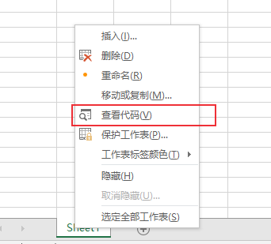

# xls批量转换为xlsx格式文件


由于使用的PHP库解析xls格式文件有问题，而将xls格式转换为xlsx格式就可以解析，考虑到xls文件有很多，需要使用批量转换文件的方法，本文介绍两种方法。


## 方法1：Python pandas库
使用Python pandas库的to_excel方法来另存为xlsx格式。

考虑到Excel文件一般有多个工作表，需要都读出来然后保存。下面直接给出代码： 
```python
import glob
import os
import time
import pandas as pd

class excelConvert():

    def __init__(self):
        self.path = os.getcwd()  # 当前工作路径
        xlsxdirname = "xlsx"
        xlsxpath = os.path.join(self.path, xlsxdirname)

        if not os.path.exists(xlsxpath):
            print(f"创建文件夹: {xlsxdirname}")
            os.makedirs(xlsxpath)
        self.xlsxpath = xlsxpath

    def batch_convert(self):
        xls_files = glob.glob(self.path + "/*.xls")
        if len(xls_files) != 0:
            print('当前目录下的xls格式文件：')
            for file in xls_files:
                print(os.path.basename(file))

                fname, _ = os.path.splitext(file)
                basename = os.path.basename(fname)
                xlsxpathname = os.path.join(self.xlsxpath, basename)
                self.saveasxlsx(file, xlsxpathname)
        else:
            print('该目录下无xls格式文件，即将退出...')
            time.sleep(2)
            os._exit(0)

    def saveasxlsx(self, xlspath, xlsxpath):
        writer = pd.ExcelWriter(xlsxpath + '.xlsx')
        datas = pd.read_excel(xlspath,sheet_name=None)
        for sheetname, values in datas.items():
            data = pd.DataFrame(values)
            data.to_excel(writer, sheet_name=sheetname)
        writer.save()
        writer.close()

if __name__=='__main__':
    excel = excelConvert()
    excel.batch_convert()
```

使用上述代码无法保留原Excel文件中的单元格样式，接下来介绍使用VBA代码进行转换。

## 方法2：VBA批量转换

使用VBA代码进行批量转换，代码来源：[https://www.extendoffice.com/documents/excel/1349-excel-batch-convert-xls-to-xlsx.html](https://www.extendoffice.com/documents/excel/1349-excel-batch-convert-xls-to-xlsx.html)

打开Excel 2007或者以上版本，**ALT + F11** 打开 Microsoft Visual Basic for Applications窗口，点击 插入-> 模块，会打开代码窗口。

或者右键点击工作表，选择【查看代码】：



输入以下代码：

```vba
Sub ConvertToXlsx()
'Updateby Extendoffice
Dim strPath As String
Dim strFile As String
Dim xWbk As Workbook
Dim xSFD, xRFD As FileDialog
Dim xSPath As String
Dim xRPath As String
Set xSFD = Application.FileDialog(msoFileDialogFolderPicker)
With xSFD
.Title = "Please select the folder contains the xls files:"
.InitialFileName = "C:\"
End With
If xSFD.Show <> -1 Then Exit Sub
xSPath = xSFD.SelectedItems.Item(1)
Set xRFD = Application.FileDialog(msoFileDialogFolderPicker)
With xRFD
.Title = "Please select a folder for outputting the new files:"
.InitialFileName = "C:\"
End With
If xRFD.Show <> -1 Then Exit Sub
xRPath = xRFD.SelectedItems.Item(1) & "\"
strPath = xSPath & "\"
strFile = Dir(strPath & "*.xls")
Application.ScreenUpdating = False
Application.DisplayAlerts = False
Do While strFile <> ""
If Right(strFile, 3) = "xls" Then
Set xWbk = Workbooks.Open(Filename:=strPath & strFile)
xWbk.SaveAs Filename:=xRPath & strFile & "x", _
FileFormat:=xlOpenXMLWorkbook
xWbk.Close SaveChanges:=False
End If
strFile = Dir
Loop
Application.DisplayAlerts = True
Application.ScreenUpdating = True
End Sub

```

点击**F5**运行，选择xls文件目录和保存xlsx文件的目录，然后会进行批量转换。

